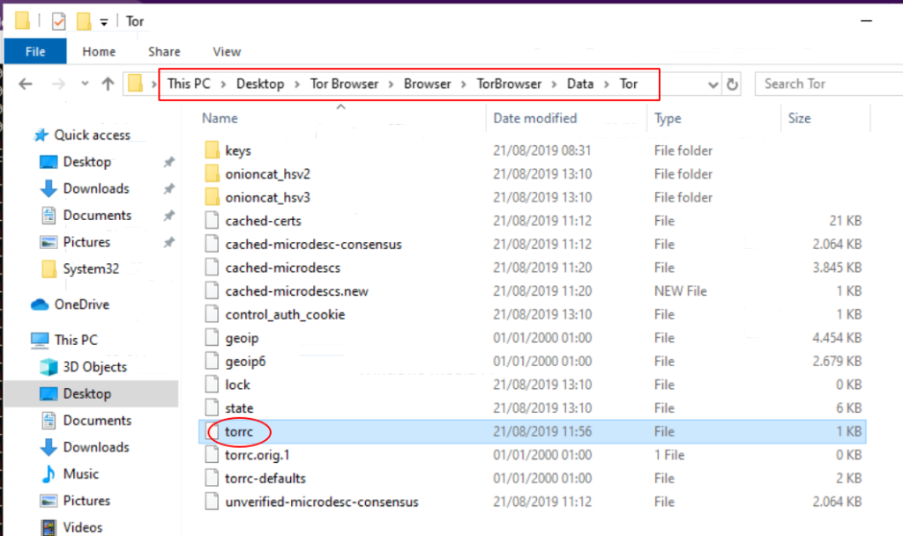
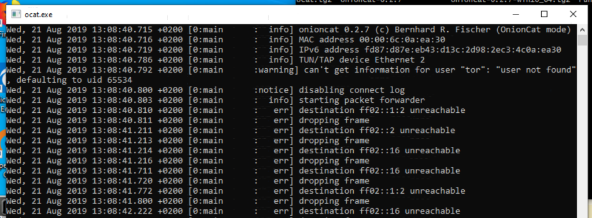

# Onioncat on Windows

Version 2.0, 2023/01/18, Bernhard R. Fischer <bf@abenteuerland.at>
Version 1.0, 2019/08/21, Bernhard R. Fischer <bf@abenteuerland.at>

Onioncat ist written in a portable manner, thus it runs on almost all operating
systems, even on Windows. This document describes how to run Onioncat on a
Windows 10 installation together with the Tor browser bundle.

This How-to was written and tested using Windows 10 Enterprise Version 22H2,
Tor Browser 12.0.1, OpenVPN 2.5.8 (and also 2.4.12), and OnionCat 4.11.0
(OnionCat 4.10.0 runs only with OpenVPN 2.4.x).

The Windows part of the code was already written in 2008, hence Onioncat on
Windows is nothing new. There were only minor changes since then. This document
is to meet recent versions of Windows, Tor, and Onioncat.

## Preface

If you read this article you probably know what you are doing, aren’t you?

Windows is not the type of operating system which is known for its good
security. Onioncat is solely used in conjunction with Tor or I2P, both being
anti-surveillance tools. If you intend to use Onioncat you are probably in a
situation where security matters and you should consider to use a system which
is designed for such circumstances, e.g. [Tails](https://tails.boum.org/), or
some other Linux distributions which are much more transparent than Windows.

If you don’t know how to use these other systems but you really need high
security you should probably seek advice from somebody near you.

If you’re still happy with Windows go ahead and read on.

## Prequisites

Onioncat needs a tunnel device which is a virtual Ethernet adapter. Windows
does not natively support such an adapter but OpenVPN includes the necessary
driver. Hence you need to [download](https://openvpn.net/community-downloads/)
and install OpenVPN. Choose the right Windows version.  It is sufficient to
customize the setup and install only the _Drivers_ section (TAP Virtual
Ethernet Adapter).

[Download](https://www.torproject.org/download/) and install Tor. It seems that
Tor for Windows can only be downloaded as the Tor Browser Bundle but that
doesn’t matter. Before running the Tor browser we have to configure it which is
explained in the next section.

Download the precompiled Windows 10 files of Onioncat from the **Releases** on Github.
Unzip the archive.  Unzip the archive somewhere. In the directory are 4 files:

* `ocat.bat` -- The batch file to run OnionCat. You have to edit it first.
* `ocat.ext` -- The OnionCat executable which is run by the previous batch file.
* `ocat-ifup.bat` -- This batch file configures the network device. It is run
  automatically by the OnionCat executable.
* `cygwin1.dll` -- A DLL which the `ocat.exe` depends on.

## Configure Tor

Before starting the Tor browser (which will start a local Tor node) we need to
configure a hidden service.

Open the "File Explorer" and navigate to the folder _"This PC > Desktop > Tor
Browser > Browser > TorBrowser > Data > Tor"_. The folder contains the
configuration file of Tor named `torrc`.



Right-click it, chose "Open with" and select the Notepad (or your favorite text
editor). Make sure that the Tor browser is _not_ running because otherwise it
will overwrite the file after you edited it. The Notepad will open the file and
show its contents. Copy the following lines into it. They configure two hidden
services for Onioncat.

```
HiddenServiceDir TorBrowser\Data\Tor\onioncat_hsv3
HiddenServicePort 8060 127.0.0.1:8060
```

Save the file and close the Notepad. Now you can start the Tor browser (there
should be an icon on your desktop) and click on "Connect".

After it started successfully, again go to the File Explorer to the same
directory ("This PC > Desktop > Tor Browser > Browser > TorBrowser > Data >
Tor"). An additional folder should have appeared: `onioncat_hsv3`.
Navigate into `onioncat_hsv3`, there’s a file named
"hostname". Open it with the Notepad (right-click -> "Open with" -> "Notepad").
The file contains the onion ID of your hidden service, e.g.
`foobar...xxx...2e6c3gboyngav2rq.onion`. Keep the file open, you will need this
string in the next step.

## Configure and Run Onioncat

Now navigate to the folder where you unzipped the OnionCat packaged and edit
the `ocat.bat` file with a text editor (e.g. Notepad).
Edit the following line in the file and replace the `SET_THIS_PROPERLY` with
your .onion hostname as found in the file `onioncat_hsv3` from above.
Save the file and close the editor.

Now right-click the `ocat.bat` again and choose "Run as administrator".
A DOS box will open and OnionCat will output a bunch of messages as show below.
Don't close the window, it would stop OnionCat.

At the first time the Windows firewall will complain that a program opens a
port. You have to choose **allow access**.



## Test Setup

Tor is running, Onioncat is running, you are ready to test the setup. Actually
you need a second Onioncat node somewhere. Of course, a single Onioncat
instance doesn’t make much sense 😉

Try to ping another running Onioncat node. Get its IPv6 address and open a
command window (type cmd in the Windows search bar on the bottom of the screen
and press enter). Now enter the command ping followed by the IPv6 address of
the target node. It may take a while (a few seconds) until the first pings will
get replied.

```
C:\Users\dummy> ping fd87:d87e:eb43:4506:3bbb:9faf:5877:4319
 Pinging fd87:d87e:eb43:4506:3bbb:9faf:5877:4319 with 32 bytes of data:
 Request timed out.
 Reply from fd87:d87e:eb43:4506:3bbb:9faf:5877:4319: time=249ms 
 Reply from fd87:d87e:eb43:4506:3bbb:9faf:5877:4319: time=361ms 
 Reply from fd87:d87e:eb43:4506:3bbb:9faf:5877:4319: time=263ms 
 Ping statistics for fd87:d87e:eb43:4506:3bbb:9faf:5877:4319:
     Packets: Sent = 4, Received = 3, Lost = 1 (25% loss),
 Approximate round trip times in milli-seconds:
     Minimum = 249ms, Maximum = 361ms, Average = 291ms
```

