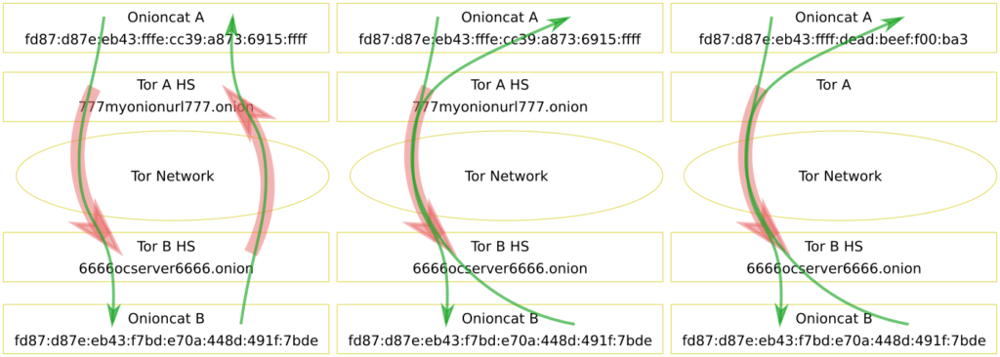

# Onioncat Security Considerations

Version 1.0, 2019/08/21, Bernhard R. Fischer <bf@abenteuerland.at>

Onioncat is an add-on for anonymization networks such as Tor and I2P. It adds
real IP layer networking capability to hosts connected through Tor. Hence it is
not enough to just refer to the security of Tor (or I2P). This article
discusses security Considerations which are specific to Onioncat. Of course,
since Onioncat relies on Tor, most security issues which are valid for the Tor
network also apply to Onioncat as well but not completely, because it is a
totally different use-case.

Onioncat was specifically designed to work with Tor’s hidden services version 2
and therein Onioncat perfectly integrates into. It will and it does work with
different systems as well (e.g. Tor hidden services v3, or I2P) but there are
some drawbacks. This will also be explained within this article.

## Understanding Onioncat

Although it is assumed that the reader is familiar with Onioncat we still try
to explain the essential part of Onioncat in brief.

Onioncat uses the hidden service feature of Tor to connect nodes to each other.
Those connections are then used to create plain IPv6 connections between these
hosts as if they where connected together on a simple Ethernet switch. That is
what every VPN adapter does and so does Onioncat. The difference between
Onioncat and other VPN adapters (such as OpenVPN) is that, firstly, Onioncat
connects through Tor’s hidden services and not through the Internet or any
other VPN service, and, secondly, the “VPN” is not privately administered.
Everybody can freely join the network.

> Onioncat is a virtual network switch with a built-in secure automatic address
> selection method.

From this we can derive 3 main topics in respect to security:

1. The security of the network itself. This issue is not discussed within this article.
2. Local network security, because Onioncat “simply” is a virtual network switch.
3. The glue between Onioncat and the Tor network.

## Local Network Security

As soon as you run Onioncat, you are connected to a network where you do not
know who is on the other side and who will connect to your system. In respect
to computer security there is no big difference compared to being connected to
the Internet.

> People who you do not know may access your system. 

If you think you are safe because your system is “just” accessible through a
hidden service where Onioncat is attached to, be advised that this is a very
dangerous assumption! Hidden services may be enumerated by an attacker or one
might run a malicious hidden service directory and grep for hidden service
descriptors. Or more simple: Running a single Onioncat instance is pretty
useless hence you most probably gave away your hidden service’s onion url
(`777myonionurl777.onion`) to somebody else, e.g. your best friend. Unless this
best friend isn’t Ed Snowden you can expect that your onion-URL was immediately
revealed to the public (because he sent it to his Office365 or Gmail account,
stored it on his “secure” smartphone, Dropbox, or whatever). Although this is
not a security risk for neither Tor nor Onioncat it lets attackers access your
system.

Accessing the system more specifically means that one could try to connect to
some well-known ports or even target a port scanner or a security scanner (e.g.
Nessus) at your Onioncat IP. Please note that an attacker may try to reveal
your anonymity!

Of course, the risk is much lower than in the Internet but there is still a
chance. Thus, all rules of security that apply to public network interfaces
also apply to your Onioncat-managed virtual tunnel interface. More specifically
consider the following:

* Run a firewall!
* Don’t trust IPs from `fd87:d87e:eb43::/48` more than others!
* Use encrypted services!
* Use authentication!
* Do not run public (Internet) services on the same host! This may immediately
  reveal your anonymity![^1] You may also read the article Onioncat In A Highly
  Secure Environment. It is not new, but you get an idea.

> Be as paranoid as you are in the Internet!

Please note that Onioncat is a layer-3 VPN, meaning it is able to forward any
IPv6 and IPv4 packets (if enabled with option `-4`) but not frames of lower
layers, e.g. Ethernet frames. Although Onioncat can be configured to use a TAP
device (instead of the TUN device), which is a virtual layer-2 device, it still
does not forward (nor process received) Ethernet frames. The Ethernet protocol
is handled fully locally between the local Onioncat and the kernel even if it
looks like if remote hosts are able to do so (e.g. if you capture with
Wireshark). Onioncat emulates this locally. This means that an attacker cannot
send ARP requests or other Ethernet broadcasts or similar frames. He cannot use
Ethernet-based attack methods but he can send any specifically crafted valid IP
packet to you.

There may be an additional risk if your system is connected to the public IPv6
network. If you run any process that tries to connect to any Onioncat service
within the network prefix `fd87:d87e:eb43::/48` but Onioncat is not running for
whatever reason, your system will leak IPv6 packets with a destination IP
address of the desired Onioncat destination. An eavesdropper could conclude at
least that you are using Onioncat. This is because the packets are caught by
the default IPv6 route. To prevent this it is suggested to have a firewall rule
in place which drops theses packets.

## The Glue Between Onioncat And Tor

IP hosts connected[^2] to each other need IP addresses to be able to communicate.
Basically, any IP address is valid and it does not matter which one in
particular is chosen as long as they are all within the same network prefix and
are not duplicate. Although this applies to Onioncat’s network interface[^3] as
well, the IP addresses are well chosen for security reasons.

Tor does only know about hosts names and in respect to hidden services these
host names must end with .onion. In contrast, IP packets are addressed by IP
addresses and not onion URLs (obviously). To address a hidden service with an
IP address some kind of reverse-lookup has to be done. And here comes Onioncat
into play.

Onioncat has an IP-based interface to the kernel and an onion-URL-based TCP
interface to Tor and it translates between them. If Onioncat receives an IP
packet from the kernel, it extracts the destination IP address, converts it to
an onion-URL and asks Tor to build a connection. Once the connection is
established, Onioncat internally associates this connection with the IP address
and starts sending and receiving IP packets with the desired destination
address between the kernel and this connection, i.e. the hidden service on the
other side.

Tor’s hidden services are designed to have a fully cryptographic integrity.
That means that the client of a hidden service (the one who connects to it) can
prove that the onion-URL and the connection is really associated with the
correct hidden service. That means that an attacker cannot pretend to be a
specific hidden service without being detected.[^4]

Onioncat translates the IPv6 addresses to onion-URLs and vice versa in such a
way that the cryptographic integrity is kept upright. Onion-URLs of hidden
services version 2 are 80 bit long numbers which are presented using
Base32-encoding. These 80 bits are directly concatenated to the IPv6 address
with the once randomly chosen Onioncat prefix fd87:d87e:eb43:::

```
              |77 7m y on io nu rl 7 77.onion
              |                        |
fd87:d87e:eb43:fffe:cc39:a873:6915:ffff|
```

Because of this technique onion-URLs and Onioncat’s IPv6 addresses can be used
interchangeably. They carry the same amount of information. This has two
important consequences:

* The cryptographic integrity of hidden services is kept through Onioncat.
* The translation mechanism is self-contained. There is no need for an external
  lookup mechanism.

## How Does The Hidden Service Identify The Client?

As previously discussed the client can cryptographically make sure to be
connected to the right destination. That means that the Onioncat which sends
the first packet (i.e. it is an outgoing connection) to a desired destination
can be sure that it will be connected to the authentic destination Onioncat.

But how does the destination identify the client? I.e. how does the Onioncat
with an incoming connection know who initiated the connection?

At first it does not know. It receives IP packets with a source and a
destination IP address but these could be hand-crafted by an attacker. The
destination address shall be it’s own IP address. This can easily be checked.

To verify the source uni-directional mode was implemented which is enabled by
default since 2013. Onioncat takes the source IPv6 address converts it to an
onion-URL and connects back trough Tor with an outgoing connection. All
outgoing IP packets are then sent through this outgoing connection and not the
incoming one.

An attacker can easily forge the source IP address but not the key and the hash
of a hidden service. Thus, the attacker will get no answers back as long as
Onioncat is running in uni-directional mode.

Uni-directional mode is disable with option -U, i.e. it then operates in
bi-directional mode. In this mode Onioncat directly replies on incoming
connections and does not request a return-connection through Tor. The advantage
of this method is that there is no additional time lost for the connection
setup of Tor and that it is not necessary to configure a hidden service at the
client side. In the latter case you could let Onioncat generate a random source
IP with option -R.

The following diagram shows three different modes of operation. It is assumed
that Onioncat A initiates the connection to Onioncat B. The picture shows a)
Onioncat B in unidirectional mode, b) Onioncat B in bi-directional mode, and c)
Onioncat B in bi-directional mode and Onioncat A with random source IP. In the
latter case Tor A does not have to have a hidden service configured. As a
consequence in this setup, Onioncat A can never receive (incoming) connections.



## Crafting V2 Hash Collisions

But what if somebody manages to generate a valid key which hashes to exactly
the same onion-URL? This is what is called a collision. To create a collision
with any random onion-URL the birthday paradox applies, thus you need to
generate about 2^40 keys to find any of two pairs with the same hash. However,
to find a collision for a specific onion URL (meaning targetting your unique
service) your still need 2^79 keys for the same probability to find a
collision.

But let’s assume Mallory really manages to generate a valid key with a
colliding hash to your service? What will happen?

The onion-URL is the unique primary key within the hidden service directory,
thus the hidden service descriptor will be overwritten by the last one. As a
consquence all hidden service connections will go to Mallory’s hidden service,
Mallory’s Onioncat, and Mallory’s honey host.

Now Mallory can capture all your incoming packets. But because you are paranoid
and set up all services to use e.g. TLS (as explained above) you immediately
identify that something is wrong before you sent any plain text password.

Of course, we could continue the “But what if…” discussion but this is out of
the scope of this article. This chapter shall give you an idea about how to
think. Secondly, since this type of attack will become feasibly in the future,
the Tor project developed version 3 of hidden services.

## Onioncat and HSv3

**For a recent description regarding OnionCat and HSv2 see**
[INTRO_TO_ONIONCAT4.txt](INTRO_TO_ONIONCAT4.txt)

Development does never end. The Tor project implemented version 3 of hidden
services. This shall improve the security of hidden services, in particular if
we take modern attack techniques and increased computational power into
account.

From a user perspective there is not much difference except that the onion-URLs
got signifficantly longer. In particular, v3 onion URLs carry 260 bits of
information. If you thouroughly read through this article it should now become
obvious that this has a significant impact on Onioncat.

Although it is simple to truncate the 260 bits to 80 to fit into the same IPv6
addressing scheme, there is no easy way back to regenerate this lost
information to make a long onion-URL from the IP address again. It requires
some kind of lookup mechanism and this in turn has some implications:

* The database wherein the lookup is done or the lookup transaction itself may
  be tampered.
* The database has to be operated by somebody and may be unavailable.
* Onioncat does not work out-of-the-box in this elegant way as it does with
  HSv2.

One might immediately think on using DNS since this could be done with a simple
reverse-lookup, DNS is not the solution. It is a well-known problem that DNS
lookups may compromise your anonymity.

The current solution uses a local text file for translation (see Onioncat and
HSv3). But again, it does not work out-of-the-box, you have to setup the hosts
file on all Onioncats which shall connect to each other.

I think that a solution should be built into Onioncat, or Tor, or both. But
unfortunately I don’t have any solution ready, just some ideas. You’re welcome
to think about this!

## Conclusion

Security is not something absolute. The level of security which should be
chosen depends mainly on the use-case. If you use Onioncat as some kind of VPN
(as I do) to be able to connect to all your services even if they are behind a
firewall and/or an uplink with dynamic IP addresses, you may choose a lower
level of security as if strong anonymity is a requirement because you are
residing in some problematic regime.

There are some attacks against hidden services. Although hidden service
enumeration seems impractical because of the huge address space of hidden
services (even with v2) and the low speed of Tor[^5] there is still a chance of
your onion-URL/IPv6 address being leaked.

Tor offers authentication for hidden services but this is not yet implemented
into Onioncat. Or more specifically I did not pay any attention to it, yet. It
probably should be on the task list. But keep in mind that Onioncat development
is a one-man show. Don’t hesitate to join the project 😉

Naturally, best practice network security should be applied.

Because of the effort and the risk which comes with HSv3 in respect to
Onioncat, I personally stick to HSv2 for now.

[^1]: If anonymity is a requirement. This may not always be the case. I use
  Onioncat on my server at home just to be able to connect to it from
  everywhere (see Evading Firewalls).
[^2]: Independently of protocol version 4 or 6.
[^3]: The tunnel interface.
[^4]: HTTP connections without TLS (HTTPS) in the Internet can be forged.
  Meaning an attacker can pretend to be some web service although he isn’t. And
  it is difficult for the client to detect this forgery.
[^5]: My personal observation is that the connection setup time is not below
  0.5 seconds and the RTT on active connections is greater than 0.2 seconds. ↵

